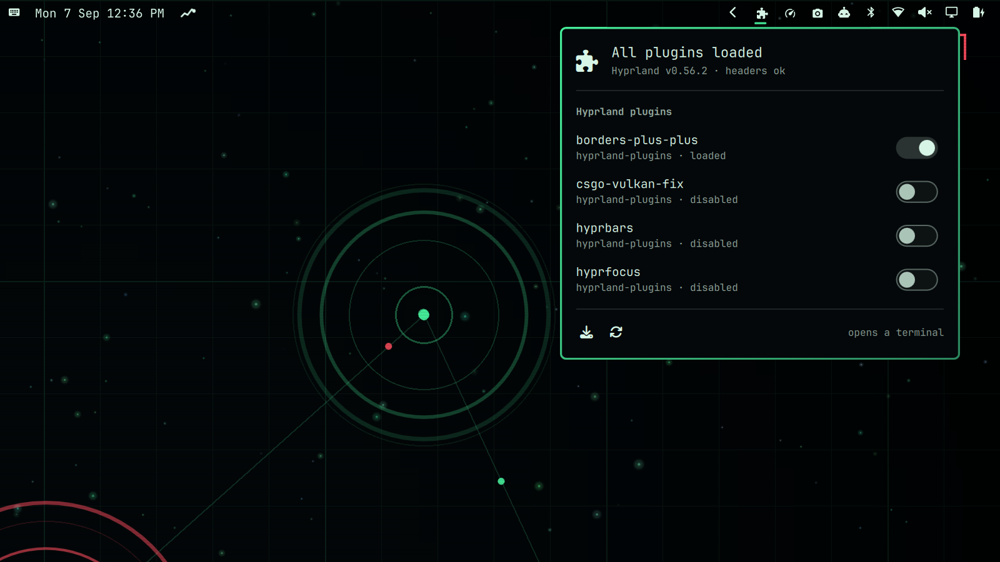

# hyprpm Manager

**Hyprland's native plugins break quietly. This tells you before they do.**

An Omarchy bar widget that watches the plugins `hyprpm` manages — `hyprexpo`,
`hy3`, `hyprbars`, `hyprscroller` and friends — and says something when they
have stopped loading, or are about to.



## Why

`hyprpm` plugins are compiled against one exact Hyprland build. Update
Hyprland and every one of them is invalidated: they silently fail to load on
the next restart, and the workspace overview or tiling layout you rely on is
simply gone, with no error anywhere you would think to look.

Omarchy has a manager for everything else — packages, themes, snapshots,
monitors, shell plugins — but nothing watches the compositor's own plugin
layer. This fills that gap.

## What it reports

| State | Bar | Meaning |
|---|---|---|
| `unavailable` | hidden | No hyprpm repositories on this machine. The widget takes no space. |
| `ok` | normal | Every enabled plugin is loaded and built against the running Hyprland. |
| `degraded` | amber | Plugins still work, but were built against a different Hyprland — they will not load after the next restart. |
| `broken` | red | Something is already wrong: a plugin failed to load or build, headers are missing, or the build tools are not installed. |

Problems are reported by **cause, not symptom**. Stale headers already explain
why a plugin did not load, so you get one `abi_mismatch`, not one complaint per
plugin.

| Code | Meaning |
|---|---|
| `deps_missing` | hyprpm's build tools are not installed (`cmake`, `cpio`, `pkg-config`, `git`, `g++`, `gcc`) |
| `headers_missing` | No Hyprland headers in the state store |
| `abi_mismatch` | Headers were built for a different Hyprland and plugins are not loading |
| `rebuild_pending` | Loaded now, but built for a different Hyprland — will not survive a restart |
| `not_loaded` | Enabled, headers fine, still not loaded |
| `build_failed` | hyprpm recorded a failed build for this plugin |

## Install

```
omarchy plugin add https://github.com/TIerTek/omarchy-hyprpm-manager --enable
```

The widget hides itself unless this machine actually uses hyprpm, so it is safe
to install before you have any Hyprland plugins.

### Removing it

```
omarchy plugin remove tiertek.hyprpm-manager
```

That is the whole removal. The only thing it leaves behind is its update cache,
if you want that gone too:

```
rm -rf ~/.cache/hyprpm-manager
```

It writes nothing else outside its own plugin directory, and it never edits your
Hyprland or Omarchy configuration — the only system state it changes is hyprpm's
own, and only when you flip a switch or press a key that says it will.

## Requirements

Everything here ships with Omarchy except `hyprpm` itself, which comes with
Hyprland.

| Needs | For |
|---|---|
| `hyprpm`, `hyprctl` | reading plugin state and the running compositor |
| `bash`, `jq`, `coreutils` (`timeout`) | the collector |
| `git` | checking whether a repository has an update (read-only `ls-remote`) |
| `libnotify` (`notify-send`) | the warning notification |
| `sudo`, `doas` or `run0` | hyprpm's own elevation when you enable, disable or update |

`cmake`, `cpio`, `pkg-config`, `g++` and `gcc` are hyprpm's build dependencies
rather than this plugin's — it does not use them, it tells you when they are
missing, because hyprpm fails with one cryptic line when they are.

### What it runs, and with what privilege

The plugin holds no privilege of its own and never modifies `sudoers`. It runs
`hyprctl` and reads files to build its status, and `git ls-remote` on a six-hour
timer to check for updates. Anything that changes hyprpm state — enable, disable,
update, reload — is handed to a visible terminal, where `bin/hyprpm-apply` asks
for elevation once with `sudo -v` before letting hyprpm run. Nothing is
downloaded and executed, and no code is fetched at runtime.

## Using it

Click the puzzle icon to open the panel. It lists every plugin hyprpm knows
about and whether it is loaded. Flipping a switch opens a terminal that runs the
enable or disable and then reloads it into the running session — enabling
without reloading would record the change but leave the compositor unaware of it.

| Key | Action |
|---|---|
| `↑` `↓` | move through the plugin list |
| `Enter` | enable or disable the selected plugin |
| `u` | `hyprpm update` — rebuild everything against the running Hyprland |
| `r` | `hyprpm reload` — load enabled plugins into the running session |
| `Esc` | close |

## Plugin updates

Separately from health, it notices when a plugin repository has moved on
upstream. This is deliberately **not** a problem and never changes the bar
colour: amber has to keep meaning *these will stop loading*, and a routine
upstream commit turning it amber too would make the warning that matters
indistinguishable from noise. **An update belongs to a repository, not to a plugin.** Every plugin in a
repository ships from one commit and moves together, so there is no such thing
as one plugin being behind while its siblings are current. Affected rows are
marked `↑` on the repository name, and a line above the buttons names the
repository and the key that updates it.

The check is a separate program, [`bin/hyprpm-updates`](bin/hyprpm-updates),
run on a six-hour timer. It is the only part of the plugin that touches the
network, which is exactly why it is separate: `hyprpm-status` never calls it and
only reads the cache it leaves behind, so the panel stays fast and works
offline. A laptop on a dead network gets a stale cache, not a panel that hangs —
and a failed lookup records *no update*, because claiming one on no evidence is
worse than silence.

## It tells you without being asked

A bar widget you have to open is no use for something that breaks while you are
not looking. A headless service checks shortly after login — when post-update
breakage actually surfaces — and every fifteen minutes after that.

It speaks **on transitions only, never on steady state**:

- Plugins already failing to load → a critical notification.
- Plugins that will stop loading after the next restart → a normal one. This is
  the warning worth having, and it must not shout or people learn to dismiss it.
- Healthy, or hyprpm unused → silence. Recovery is silent too; nobody needs an
  all-clear.

Repeats are suppressed by a *signature* (state plus the sorted problem codes)
that survives a shell reload, so `omarchy restart shell` — which happens during
updates, exactly when things break — does not re-announce old news. A changed
signature is news even inside the quiet window; an unchanged one re-arms after
twelve hours.

## It never elevates

`hyprpm update` compiles Hyprland and needs root, but refuses to be run *as*
root — it elevates internally. Rather than wrap that, **this plugin holds no
privilege at all**: update and reload are handed to a visible floating
terminal, the same way Omarchy's built-in system-update widget does it. You see
the build output and the password prompt lands somewhere real.

Enabling or disabling a plugin opens that terminal too. hyprpm elevates for
*every* state write, not just builds — a switch flipped quietly in the
background fails with `Failed to write plugin state` and springs back with no
explanation, so the terminal is the honest thing to show you.

## How it works

All detection lives in [`bin/hyprpm-status`](bin/hyprpm-status), a shell script
that prints one JSON document and always exits 0:

```json
{ "schema": 1, "state": "broken",
  "hyprland": { "tag": "v0.56.2", "commit": "efb5099..." },
  "headers": { "status": "mismatched" },
  "plugins": [ { "name": "hyprexpo", "enabled": true, "loaded": false } ],
  "problems": [ { "code": "abi_mismatch", "fix": "hyprpm update" } ] }
```

It reads hyprpm's own `state.toml` files for what *should* be loaded and the
running compositor for what *is* — never hyprpm's ANSI-coloured human output.
The bar widget and the notifier share this one collector, so they can never
disagree about what "broken" means, and `NotifyModel.js` owns both the decision
to notify and the human wording of every problem code.
The QML only renders the result, so the state machine can be changed and tested
without touching the UI. See [docs/detection.md](docs/detection.md).

## Tests

```
tests/test-status.sh          # detection: 14 fixtures
tests/test-updates.sh         # upstream check, with git stubbed
tests/test-apply.sh           # enable/disable helper, with hyprpm stubbed
node tests/test-notify-model.cjs   # when to notify, against a fake clock
```

Twelve fixtures cover every state, including ones that are painful to
reproduce on a live compositor. The collector takes `hyprctl`, the state store
path and the dependency list from environment variables, so the suite never
touches the real state store or the running session.

## License

MIT
